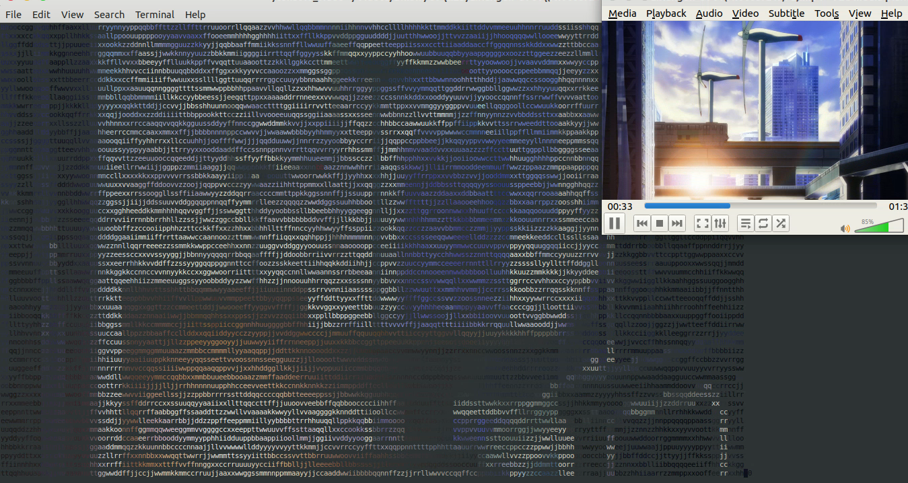

## Play video in console/terminal. Character image.

## Dependency

+ OpenCV Lib
+ Terminal should support 24bit color

## Usage(Linux)

```shell
# build
make

# run 
./console_video {video_file_name}
```

## Screenshot

 

## END

<leopard.c@outlook.com>

